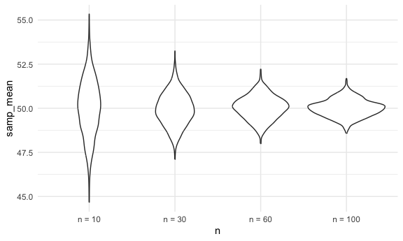
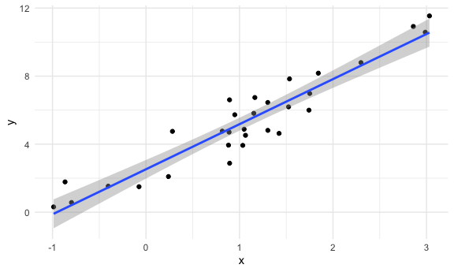
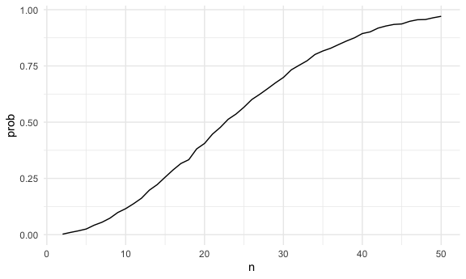
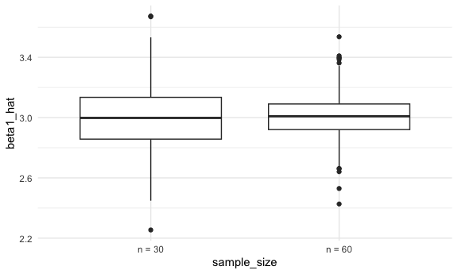
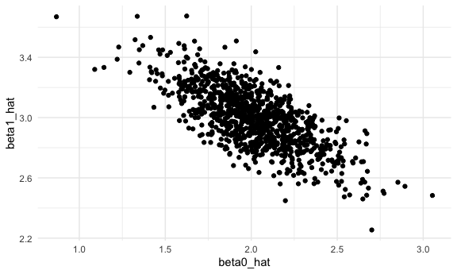

Simulations
================

Load key packages.

``` r
library(tidyverse)

set.seed(1031)
```

## writing a simulation function

``` r
sim_mean_sd = function(samp_size, true_mean = 10, true_sd = 5) {
  
  sim_df = 
    tibble(
      x = rnorm(samp_size, true_mean, true_sd)
    )

  out_df = 
    sim_df |> 
    summarize(
      samp_mean = mean(x),
      samp_sd = sd(x)
    )
  
  return(out_df)
}

sim_mean_sd(samp_size = 30, true_mean = 4, true_sd = 12)
```

    ## # A tibble: 1 × 2
    ##   samp_mean samp_sd
    ##       <dbl>   <dbl>
    ## 1      4.33    11.4

run this a lot of times …

``` r
sim_mean_sd(30)
```

    ## # A tibble: 1 × 2
    ##   samp_mean samp_sd
    ##       <dbl>   <dbl>
    ## 1      7.38    4.68

run this using a for loop?

``` r
output = vector("list", 1000)

for (i in 1:1000) {
  
  output[[i]] = sim_mean_sd(30)
  
}

# output

bind_rows(output) |> 
  summarize(
    ave_samp_mean = mean(samp_mean),
    SE_samp_mean = sd(samp_mean))
```

    ## # A tibble: 1 × 2
    ##   ave_samp_mean SE_samp_mean
    ##           <dbl>        <dbl>
    ## 1          9.94        0.920

Can I use map instead

``` r
sim_res = 
  tibble(
    iter = 1:1000
  ) |> 
  mutate(samp_res = map(iter, sim_mean_sd, samp_size = 30)) |> 
  unnest(samp_res)
```

Could I try different sample sizes?

``` r
sim_res = 
  expand_grid(
    n = c(10, 30, 60, 100),
    iter = 1:1000
  ) |> 
  mutate(samp_res = map(n, \(x) sim_mean_sd(x, true_mean = 50))   ) |> 
  unnest(samp_res)
```

``` r
sim_res |> 
  group_by(n) |> 
  summarize(
    se = sd(samp_mean)
  )
```

    ## # A tibble: 4 × 2
    ##       n    se
    ##   <dbl> <dbl>
    ## 1    10 1.61 
    ## 2    30 0.927
    ## 3    60 0.664
    ## 4   100 0.491

``` r
sim_res |> 
  mutate(
    n = str_c("n = ", n),
    n = fct_inorder(n)) |> 
  ggplot(aes(x = n, y = samp_mean)) + 
  geom_violin()
```



go even simpler for a sec

``` r
sim_mean_sd = function(samp_size) {
  
  sim_df = 
    tibble(
      x = rnorm(samp_size, 10, 5)
    )

  out_df = 
    sim_df |> 
    summarize(
      samp_mean = mean(x),
      samp_sd = sd(x)
    )
  
  return(out_df)
}

sim_res = 
  expand_grid(
    n = c(10, 30, 60, 100),
    iter = 1:1000
  ) |> 
  mutate(samp_res = map(n, sim_mean_sd   )) |> 
  unnest(samp_res)
```

### SLR

``` r
sim_data = 
  tibble(
    x = rnorm(30, mean = 1, sd = 1),
    y = 2 + 3 * x + rnorm(30, 0, 1)
  )

lm_fit = lm(y ~ x, data = sim_data)

sim_data |> 
  ggplot(aes(x = x, y = y)) + 
  geom_point() + 
  stat_smooth(method = "lm")
```

    ## `geom_smooth()` using formula = 'y ~ x'



## Birthday problem!!!

Let’s put people in a room.

``` r
bday_sim = function(n) {

  bdays = sample(1:365, size = n, replace = TRUE)
  
  duplicate = length(unique(bdays)) < n

  return(duplicate)
  
}

bday_sim(10)
```

    ## [1] FALSE

run this a lot

``` r
sim_res = 
  expand_grid(
    n = 2:50,
    iter = 1:10000
  ) |> 
  mutate(res = map_lgl(n, bday_sim)) |> 
  group_by(n) |> 
  summarize(prob = mean(res))

sim_res |> 
  ggplot(aes(x = n, y = prob )) + 
  geom_line()
```



Turn this into a function

``` r
sim_regression = function(n) {
  
  sim_data = 
    tibble(
      x = rnorm(n, mean = 1, sd = 1),
      y = 2 + 3 * x + rnorm(n, 0, 1)
    )

  lm_fit = lm(y ~ x, data = sim_data)

  out_df = 
    tibble(
      beta0_hat = coef(lm_fit)[1],
      beta1_hat = coef(lm_fit)[2]
    )
  
  return(out_df)

}


sim_res = 
  expand_grid(
    sample_size = c(30, 60), 
    iter = 1:1000
  ) |> 
  mutate(lm_res = map(sample_size, sim_regression)) |> 
  unnest(lm_res)

sim_res |> 
  mutate(sample_size = str_c("n = ", sample_size)) |> 
  ggplot(aes(x = sample_size, y = beta1_hat)) + 
  geom_boxplot()
```



``` r
sim_res |> 
  filter(sample_size == 30) |> 
  ggplot(aes(x = beta0_hat, y = beta1_hat)) +
  geom_point()
```


